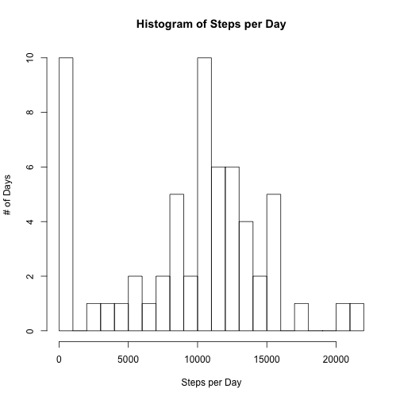
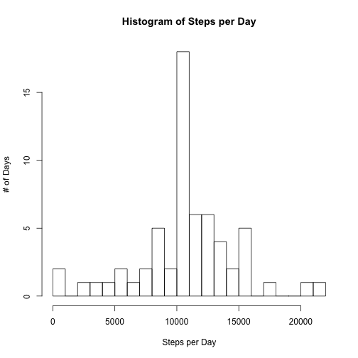
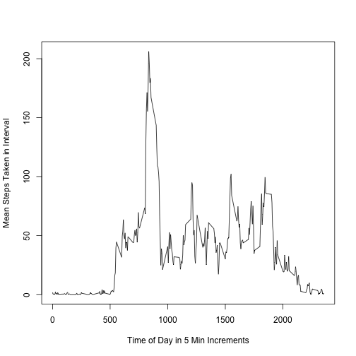

##### The data for this analysis comes from Roger Peng's github account https://github.com/rdpeng/RepData_PeerAssessment1 and was forked on 6/6/2015.


```r
proj_data <- read.csv("./activity.csv")
head(proj_data)
```

```
##   steps       date interval
## 1    NA 2012-10-01        0
## 2    NA 2012-10-01        5
## 3    NA 2012-10-01       10
## 4    NA 2012-10-01       15
## 5    NA 2012-10-01       20
## 6    NA 2012-10-01       25
```

### The purpose of this analysis is to determine and illustrate the impact of missing values on this dataset. Further, we examine the differences between weekends and weekdays.
### First, two analyses are performed - first with missing data ignored and second with missing values replaced with average values
### First Analysis
#### Ignoring missing values, we examine the mean and median number of steps per day

```r
daily_steps <- tapply(proj_data$steps, proj_data$date, sum, na.rm = TRUE)
hist(daily_steps, xlab = "Steps per Day", ylab = "# of Days", main = "Histogram of Steps per Day", breaks = 25)
```

 

#### The calculated mean and median number of steps per day are:


```r
cat("Mean = ", mean(daily_steps),"\nMedian = ", median(daily_steps))
```

```
## Mean =  9354.23 
## Median =  10395
```

#### Omitting missing values, we view the average daily activity pattern using a time series plot of the 5-minute interval and the average number of steps taken, averaged across all days

```r
mean_interval_steps <- tapply(proj_data$steps, proj_data$interval, mean, na.rm = TRUE)
plot(names(mean_interval_steps),
     mean_interval_steps,  
     type="l", 
     xlab = "Time of Day in 5 Min Increments", 
     ylab = "Mean Steps Taken in Interval")
```

 

#### The 5-minute interval, on average across all the days in the dataset, that contains the maximum number of steps is:

```r
names(which.max(mean_interval_steps))
```

```
## [1] "835"
```
and the value is

```r
max(mean_interval_steps)
```

```
## [1] 206.1698
```

### Now we impute values for the NA data in the dataset and once again run a second analysis to see if this significantly changes our view of the results
#### The number of observations (rows) with missing values is:

```r
sum(is.na(proj_data$steps))
```

```
## [1] 2304
```
#### Replace the missing values with the mean for that period across all days and store in a new dataframe

```r
nas <- is.na(proj_data$steps)
proj_data_no_nas <- proj_data
proj_data_no_nas$steps[nas] <- mean_interval_steps[as.factor(proj_data_no_nas$interval[nas])]
```

#### The histogram of steps per day shifts with the imputed missing values and the maximum number of steps in a day increases


```r
daily_steps_no_nas <- tapply(proj_data_no_nas$steps, proj_data_no_nas$date, sum)
hist(daily_steps_no_nas, xlab = "Steps per Day", ylab = "# of Days", main = "Histogram of Steps per Day", breaks = 25)
```

 

#### The calculated mean and median number of steps increases slightly because we replaced the missing values with the mean for the period across all days.


```r
cat("Mean = ", mean(daily_steps_no_nas),"\nMedian = ", median(daily_steps_no_nas))
```

```
## Mean =  10766.19 
## Median =  10766.19
```

#### Since we replaced the missing values with the mean, we would expect the plot of the mean steps in each period to remain unchanged, which is exactly what we see


```r
mean_interval_steps_no_nas <- tapply(proj_data_no_nas$steps, proj_data_no_nas$interval, mean)
plot(names(mean_interval_steps_no_nas),
     mean_interval_steps_no_nas,  
     type="l", 
     xlab = "Time of Day in 5 Min Increments", 
     ylab = "Mean Steps Taken in Interval")
```

 

#### The 5-minute interval, on average across all the days in the dataset, that contains the maximum number of steps remains unchanged:

```r
names(which.max(mean_interval_steps_no_nas))
```

```
## [1] "835"
```
and the value is

```r
max(mean_interval_steps_no_nas)
```

```
## [1] 206.1698
```
### The conclusion is that while the maximum steps in a day increases with the imputed values, the impact on the mean and median is not significant
## Now we examing the difference between weekends and weekdays in the number of steps taken
### Subset the data, then plot with Lattice

```r
library(reshape2)
library(lattice)
proj_data_no_nas$day <- weekdays(as.Date(proj_data_no_nas$date,"%Y-%m-%d"),
                                 abbreviate = TRUE)
proj_data_no_nas$day[proj_data_no_nas$day %in% c("Mon","Tue","Wed","Thu","Fri")] <- "Weekday"
proj_data_no_nas$day[proj_data_no_nas$day %in% c("Sat","Sun")] <- "Weekend"
proj_data_no_nas$day <- as.factor(proj_data_no_nas$day)
mean_steps_by_day <- dcast(proj_data_no_nas, interval ~ day, value.var = "steps", fun.aggregate = mean)
mean_steps_by_dow <- melt(mean_steps_by_day, id.vars = "interval")
xyplot(mean_steps_by_dow$value ~ mean_steps_by_dow$interval|mean_steps_by_dow$variable,
       type="l",
       xlab = "Time of Day",
       ylab = "Mean Steps Taken")
```

 

